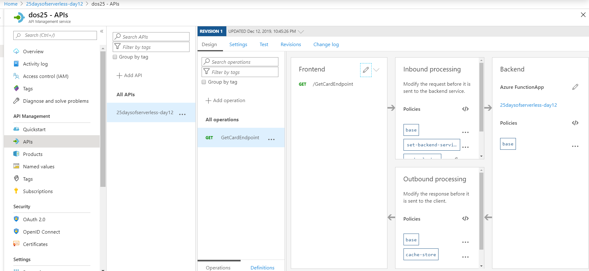
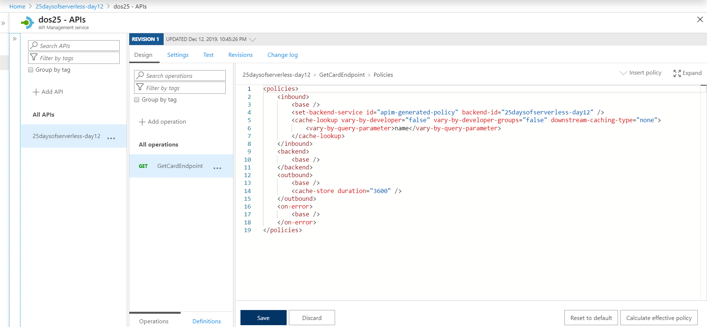
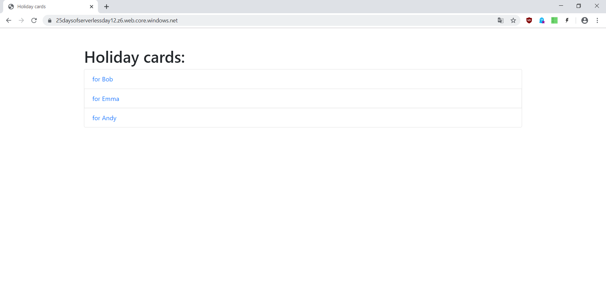
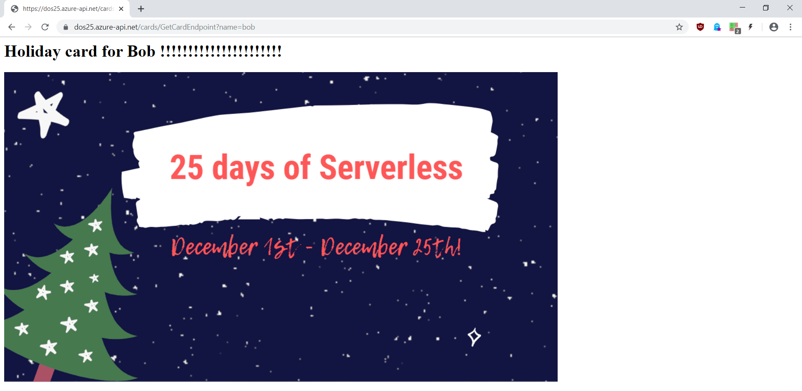

# Challenge 12: Caching

## Implementation
**Function App** with [Oktokit](https://github.com/octokit) to download the [Gist](https://gist.github.com/mochecki/51612d5eef3c3ed8d8da3a608d0b49ee) with multiple files (one file per card) and store in **Redis Cache**. 

[Markdig](https://github.com/lunet-io/markdig_) to convert markdown file to HTML.

**API Management (Consumption Plan)** with external **Redis Cache** to cache HTML responses for cards - vary by query parameter.

